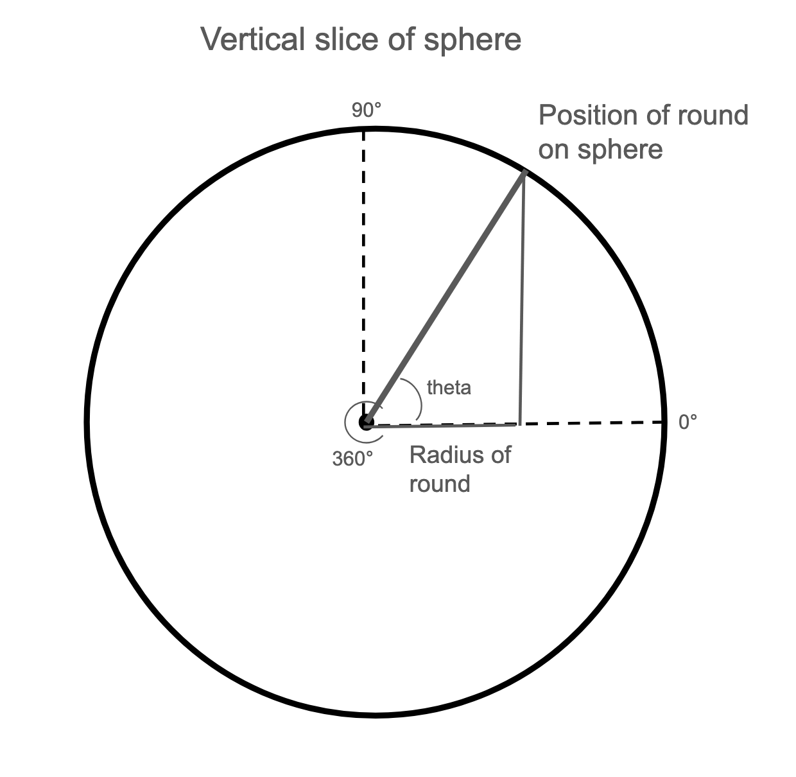

# crochet-pattern-maker

## Crochet Basics and the Program's Purpose

### What is Crochet?

Crochet is the process of using yarn and a crochet hook (a specially shaped rod with a hook on the end) to create a kind of fabric by pulling loops of yarn through other loops of yarn. The way this fabric is created determines its shape and therefore allows it to be made into large variety of items. This program is specifically for Amigurumi, which is the process of using crochet to make 3D items (e.g. plushies).

### What are Crochet Patterns?

Crochet patterns are a set of instructions that crocheters use to make a specific item. Most crocheters find patterns online to help them make the items they want, but some make their own patterns. Making a pattern requires familiarity with techniques to make common shapes, as well as a decent understanding of the math/logical process that is behind creating good-looking shapes with crochet.

### What is the Purpose of This Program?

This program is designed to help crocheters make their own patterns. I have taken the implicit logic that is used to make crochet patterns and explicitly stated it as code so that my program can generate a crochet pattern based of the given specifications. While it cannot immediately make a pattern for a specific item (e.g. a sheep), it can make basic shapes that can be combined to make those items (e.g. a sphere for the body).

A secondary purpose of this program is to make *mathematically accurate* crochet patterns. For example, the current standard method for making a crochet sphere is technically to make a cone, followed by a cylinder, followed by another cone, and once stuffed these shapes end up looking pretty close to a sphere. This program uses math to make an actual sphere of any size (which is helpful as the standard method looks less like a sphere in larger sizes).

### Other Crocheters Who Gave me Inspiration

I am NOT the first person to wanted to make mathematically accurate crochet sphere. MsPremiseConclusion is the one who gave me the idea via this article https://mspremiseconclusion.wordpress.com/2010/03/14/the-ideal-crochet-sphere/. The math I use in this program to make a sphere is entirely of her creation, however the code is all original. At time of writing, this program doesn't make any other shapes, but I plan to add more soon. The math for those shapes will likely be similar to the math for a sphere, and thus I again thank MsPremiseConclusion for introducing this general method of making mathematically accurate crochet shapes.

### Glossary of Crochet Terms

- **Stitch:** a single unit of crochet that is repeated over and over again to make a crochet item. *Abbreviation: st*
- **Row:** one length of 2D crochet; these lengths are stacked on top of each other to make a flat shape (e.g. rectangles, triangles). One row is created by making a line of stitches in one direction, and the next row is created by making a line of stitches in the other direction.
- **Round:** one length of 3D crochet; these lengths are also stacked on top of each other, but they make 3D shapes (e.g. spheres). One round is created by making a circle of stitches, and the next round is created by making another circle directly on top of the previous, forming a tight spiral shape. *Abbreviation: rd*
- **Chain stitch:** the foundational crochet stitch; it serves as the foundation for a lot of crochet items, as it can be made with just a strand of yarn. *Abbreviation: ch*
- **"Worked into":** crochet is a process of pulling loops of yarn (aka stitches) through other loops of yarn (aka stitches). The stitch currently being made is "worked into" the previous stitch (i.e. the loop currently being made is worked into, aka pulled through, the previous loop). 
- **Magic loop:** a special technique used to start crochet that is done in the round; it ensures that the top of an item remains closed and doesn't form a hole.
- **Single crochet:** the most basic crochet stitch; it makes up most of the volume of Amigurumi crochet items, and must be worked into one stitch. *Abbreviation: sc*
- **Increase:** the stitch used to increase the size of an item; it increases the total stitches in a row or round by one, and must be worked into one stitch. *Abbreviation: inc*
- **Decrease:** the stitch used to decrease the size of an item: it decreases the total stitches in a row or round by one, and must be worked into two stitches. *Abbreviation: dec*

## How the Program Works

### Shapes it can Currently Make *Correctly*

*Assuming I remembered to update the readme after making changes*
- None

### Shapes it can Currently Make *Incorrectly*

*Assuming I remembered to update the readme after making changes*
- Sphere: when prompted by the program, enter the radius of your desired sphere in inches, your crochet stitch gauge, and your crochet round gauge, and it will generate a pattern that will allow you to make a sphere of that size. *For details on how it is making a sphere incorrectly, see the issues page on the GitHub.*

### Math Behind Making A Sphere

A crochet sphere is made of rounds of crochet stacked on top of each other. To make a sphere of a certain size, we need the total number of stitches in each round. To find the total number of stitches in a round, we need to find the circumference of each round (i.e. the circumference of the cross-sections of the sphere at the heights corresponding to each round). To find those circumferences, we will work with a vertical cross-section of the sphere.

Assume the center of the circular cross-section is split into 360 degrees, with the top of the sphere being 90 degrees and the right side being 0 degrees. The edge of the circle represents all the possible positions of a round, and each of these positions has a corresponding radius on the circle. The radius of the *circle* can be used to find the radius of a *round*, which can then be used to find the circumference of a round; phrased another way, the vertical radius of a sphere can be used to find the smaller horizontal radii that result from taking horizontal cross-sections of the sphere. So for a round whose position is determined by theta, its radius is given by the equation *radius of round = radius of sphere x cos(theta)*, and the circumference is given by *circumference of round = radius of round x 2pi*. To find the stitch totals for each round, we just need to express the circumference in units of stitches instead of traditional distance measurements. To do this, convert the radius of sphere from inches to stitches by multiplying the desired radius (in inches) by the stitch gauge (in stitches per inch), and use that number in the equations.

To find the theta associated with each round, we need to find out how tall a round is in terms of degrees. We can do this by multiplying the desired radius of the sphere (in inches) by the round gauge (in rounds per inch) to find the radius of the sphere in rounds. We can then take the radius times 2pi to find the circumference in rounds. Then divide 360 degrees by the circumference to find the degrees per one round.

### Formatting a Pattern From Stitch totals

When creating a crochet pattern, most people start with stitch totals for each round, then format the instructions based on those totals. To better understand the logic that goes into this formatting, here are some example stitch totals:
- Rd 1: 6 st
- Rd 2: 11 st
- Rd 3: 13 st
- Rd 4: 13 st
- Rd 5: 11 st
- Rd 6: 6 st

And here is a walkthrough of how to format the rounds:

- For round 1, we start the crochet with 6 single crochet in a magic ring. -> Rd 1: 6 sc in magic ring (6)
- For round 2, we go from 6 stitches in the previous round to 11 stitches in this round, so we need 11 - 6 = 5 increases. Since increases are worked into one stitch, and there are 6 stitches in the previous round, there is one remaining stitch after the 5 increases, so we will do one single crochet. -> Rd 2: 5 inc, 1 sc (11)
- For round 3, we go from 11 stitches to 13, so we need 2 increases. Since increases add material to the crochet item, we want to distribute them evenly throughout the round, so that the item grows evenly on all sides. We are working into 11 stitches, so we need 9 single crochets in addition to the 2 increases. 9 divided by 2 is 4 (with a remainder of one), so each increase will be "paired" with 4 single crochets to distribute them evenly, and we will add the remaining single crochet on at the end. Crocheters are like programmers and don't like to repeat themselves, so we will write "x2" to indicate that the group of stitches is repeated twice. -> Rd 3: (4 sc, inc) x2, 1 sc (13)
- For round 4, we have 13 stitches just like the last round, so we single crochet into every stitch. -> Rd 4: sc in each st in rd (13)
- For round 5, we go from 13 stitches to 11, so we need 2 decreases, and just like the increases, we want them to be evenly distributed. Since decreases are worked into 2 stitches, and we are working into 13 stitches, we need 13 - 2(2) = 9 single crochets. 9 single crochets divided by 2 decreases is 8 stitches (with a remainder of one), so each decrease will be paired with 4 singles crochets, and one single crochet will go at the end. -> Rd 5: (4 sc, dec) x2, 1 sc (11)
- For round 6, we need to go from 11 stitches to 6, so we need 5 decreases. We are working into 11 stitches, so 11 - 5(2) = 1 single crochet, and this single crochet will go at the end. -> Rd 6: 5 dec, 1 sc (6)

In longer patterns, an alternate format may be used, which is explained below:

- Say the current round has 13 stitches, and the previous has 9, so 13 - 9 = 4 increases. The 9 stitches we are working into minus the 4 increases results in 5 single crochets, and 5 divided by 4 increases is one single crochet per increase (with a remainder of one). -> Rd n: (1 sc, inc) x4, 1 sc (13)
- Say the next round has 16 stitches, so 16 - 13 = 3 increases. If we walk through the normal logic, we would end up with (3 sc, inc) x3, 1 sc (16). However, if we follow this process for the whole pattern, the increases/decrease of each round will stack on top of the increases/decreases of every other round and creates "bubbles" in the item. To prevent this, each round should have its increases/decreases offset by half a "section" (the stitches that are repeated) from the previous round. To do this, we put half of a section at the beginning of the round, and the other half at the end. A section in this example is "3 sc, inc", so the half that will go at the beginning of the round is "1 sc, inc", and the half that will go at the end is "2 sc". The standard is to put the increase/decrease in the beginning half, and put any remainders from dividing an odd number at the end (plus any other remaining stitches from division in previous steps). -> Rd n+1: 1 sc, inc (3 sc, inc) x2, 3 sc (16)

## How the Code Works

### The Structure of the Code

**InputHandler**

*The purpose of this class is to get sphere specifications from the user*
- Uses scanner to ask for the radius of the desired sphere in inches, the users crochet stitch gauge in stitches per inch, and their crochet round gauge in rounds per inch
- If the given inputs are not ints or doubles, prints a message correcting the user
- Multiplies the radius by the stitch gauge to get the radius in stitches, the radius by the round gauge to get the radius in rounds, and the radius in rounds by 2pi to get the circumference in rounds
- All of the above is done in the constructor
- There is a secondary constructor that takes the values directly instead of through scanner for convenience while developing
- Also has getters for the purpose of testing

**SphereMaker**

*The purpose of this class is to generate the stitch totals for all the rounds needed to make the desired sphere*
- Constructor gets the radius in stitches and circumference in rounds from the inputHandler
- The generate rounds method uses the math described above to generate stitch totals for the first half of the rounds (i.e. the rounds with increases)
- Loops to generate stitch totals, starting with the round at the top of the sphere where theta equals 90 - degreesPerRound, and decreases theta by degreesPerRound every loop, with the loop ending when theta is less than zero
- If the loop has ended, and the last value for theta that it used is more than half of degreesPerRound, there is a "missing" round that was "lost" by splitting the sphere in half, so adds another stitch total for a round exactly at zero degrees
- Finally, since a sphere has identical hemisphere, it duplicates and reverses the current stitch totals to get the totals for the remaining rounds (excluding the possible "missing" round)
- Has a getter for the stitchesPerRound instance variable that calls generateRounds then returns StitchesPerRound
- Also has other getters for the purpose of testing

**RoundComponentMaker**

*The purpose of this class is to make many roundComponent objects that represent the "components" of each round (mainly the groups of stitches, but also other components, e.g. the round number) and store these components in nested lists (the inner layer of list containing components and representing a round, the outer layer containing lists of components and representing a full pattern)*
- Constructor gets stitchesPerRound from SphereMaker
- Makes components for the first round, which will always use a magic loop and thus needs special components
- Makes components for the rounds with increases and the rounds with decreases

RoundComponentAssembler

### How to Run the Program

At time of writing, the only way to run the program is to download the files through git, and open them in a code editor. Next, run the main function, and give inputs and receive outputs via the console.